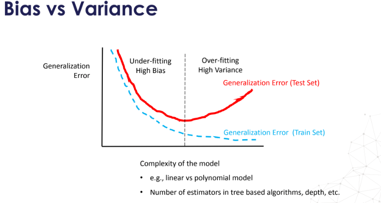

# 🔁 Cross-Validation Schemes
- Cross-validation helps estimate **generalization error** and **select hyperparameters**.
- Always keep a **separate test set** for final performance evaluation.
- Smaller training sets during CV can lead to **high bias** (underfitting).
   - If the training set is too small, it may not contain enough examples of important variations or relationships in the data.
   - As a result, the model learns overly simplistic rules that fail to capture complexity.
- Larger training sets reduce bias but may increase **variance** (overfitting to noise).
  - With more data, practitioners are tempted (and justified) to use more complex models (deep nets, ensembles, etc.).
  - Complex models can memorize noise or overfit localized patterns
 
## Bias vs Variance

 

This chart shows how **generalization error** changes with **model complexity**, helping us understand the trade-off between **bias** and **variance**.

### 🔵 Training Set Error (Blue Line)
- Decreases steadily as model complexity increases.
- A more complex model fits the training data better.

### 🔴 Test Set Error (Red Line)
- Decreases initially (improving generalization), then increases again.
- This U-shaped curve shows where **overfitting begins**.

### Key Zones (Refer to Chart):

- **Left Side – Underfitting (High Bias)**:
  - Simple models (e.g., linear regression, few trees).
  - **High training and test errors**.
  - Model fails to capture data patterns.

- **Middle – Just Right**:
  - Balanced model complexity.
  - **Lowest test error** → best generalization.
  - Ideal model capacity for the task.

- **Right Side – Overfitting (High Variance)**:
  - Very complex models (e.g., deep trees, high-degree polynomials).
  - **Low training error**, but **test error increases**.
  - Model memorizes training data and fails to generalize.

- The goal is to find the “sweet spot” in model complexity where test error is minimized — this is where **bias and variance are balanced**.

---

## 1. **K-Fold Cross-Validation**
- **Description**: Split training data into *k* equal parts (folds).
- Train on *k-1* folds, validate on the remaining fold.
- Repeat *k* times with different validation folds.
- **Output**: Average performance ± standard deviation.
- **Typical k values**: 5 or 10.
- **Pros**:
  - Widely used and efficient.
  - No overlap in validation folds.
- **Cons**:
  - May not handle imbalanced datasets well.

---

## 2. **Leave-One-Out Cross-Validation (LOOCV)**
- **Description**: Special case of K-Fold where *k = n* (n = number of observations).
- Train on *n-1* samples, test on the single remaining one.
- Repeat *n* times.
- **Pros**:
  - Utilises nearly all data for training.
  - Good for small datasets.
- **Cons**:
  - Very **computationally expensive**.
  - **High variance** due to minimal differences in training sets.
  - **Not suitable** for metrics like ROC-AUC, precision, or recall (due to 1 test sample).

---

## 3. **Leave-P-Out Cross-Validation (LPOCV)**
- **Description**: Leave out all possible subsets of *p* observations.
- Train on *n-p*, test on *p* observations.
- **Pros**:
  - Larger test sets improve metric stability (vs. LOOCV).
- **Cons**:
  - **Extremely expensive**: factorial number of combinations.
  - **Overlapping test sets**.

---

## 4. **Repeated K-Fold Cross-Validation**
- **Description**: Perform K-Fold CV *n* times with shuffled data.
- Each repetition gives a new train/test split.
- **Output**: *k × n* performance metrics.
- **Pros**:
  - Provides a more **robust estimate** of model performance.
  - Reduces bias from a single data split.
- **Cons**:
  - Test sets may **overlap across repetitions**.

---

## 5. **Stratified K-Fold Cross-Validation**
- **Description**: Variant of K-Fold for **classification problems**.
- Ensures each fold has similar **class distribution**.
- **Essential** when dealing with **imbalanced datasets**.
- **Pros**:
  - Prevents folds without minority class examples.
  - Better performance estimation in classification tasks.
- **Cons**:
  - Only applicable to **classification**, not regression.

---

## 🧠 When to Use What?
- ✅ **K-Fold (k=5 or 10)**: Good default, works well in most scenarios.
- ✅ **Stratified K-Fold**: Use for **classification**, especially with class imbalance.
- ❌ **Leave-One-Out**: Use only for **small datasets** with continuous error metrics (e.g., MSE).
- ❌ **Leave-P-Out**: Rarely used due to high computational cost.
- ✅ **Repeated K-Fold**: Good when seeking more robust performance estimates.

